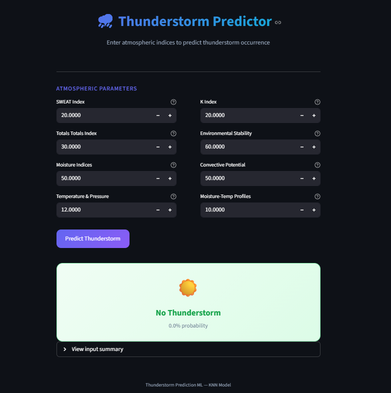

# Thunderstorm Prediction

An end-to-end machine learning project that predicts thunderstorm occurrence using atmospheric indices. The system features experiment tracking with MLflow, a FastAPI backend for serving predictions, and a modern Streamlit frontend.



---

## System Architecture


The project is organized into three layers:

- **Frontend** — Streamlit serves the web UI where users input atmospheric parameters and view predictions.
- **Backend** — FastAPI receives requests from the frontend, validates input via Pydantic, and runs model inference.
- **Core** — The ML engine built with scikit-learn, pandas, matplotlib, and Jupyter notebooks. MLflow tracks all experiments, parameters, and metrics locally.
- **Tooling** — UV for package management, GitHub for source control.

---

## Project Structure

```
Thunder Strom Prediction/
├── app/                        # Core application logic
│   ├── __init__.py
│   ├── config.py               # Model path configuration
│   ├── model_loader.py         # Loads the trained model (singleton)
│   ├── predictor.py            # Prediction logic with feature mapping
│   └── schemas.py              # Pydantic input validation schemas
│
├── api/
│   └── main.py                 # FastAPI backend (REST API)
│
├── streamlit_app/
│   └── ui.py                   # Streamlit frontend
│
├── experiments/
│   ├── experiment.ipynb        # EDA, training, hyperparameter tuning
│   └── mlruns/                 # MLflow experiment tracking data
│
├── data/
│   ├── raw/                    # Original datasets (index.csv, surface.csv)
│   └── processed/              # Cleaned & merged dataset
│
├── models/                     # Saved model artifacts (.pkl)
├── local-requirements.txt      # Python dependencies
└── .gitignore
```

---

## How It Works

### 1. Experimentation & Training (`experiments/experiment.ipynb`)

The notebook handles the full ML pipeline:

- **Data loading** — reads raw atmospheric data from `data/raw/` (radiosonde indices and surface observations).
- **Preprocessing** — merges datasets, handles missing values, and engineers features like SWEAT Index, K Index, Totals Totals Index, and others.
- **Model training** — trains multiple classifiers and performs hyperparameter tuning via GridSearchCV.
- **Evaluation** — uses meteorology-specific metrics: POD (Probability of Detection), FAR (False Alarm Ratio), HSS (Heidke Skill Score), CSI (Critical Success Index), alongside standard accuracy, precision, recall, and F1.
- **Experiment tracking** — all runs, parameters, and metrics are logged to MLflow locally (`experiments/mlruns/`).
- **Model export** — the best model (KNN) is saved as `models/KNN_best_model.pkl`.

### 2. Backend — FastAPI (`api/main.py`)

The backend exposes a REST API for real-time predictions:

| Endpoint       | Method | Description                          |
|----------------|--------|--------------------------------------|
| `/`            | GET    | Health check                         |
| `/predict`     | POST   | Accepts 8 atmospheric features, returns prediction & probability |

**Request flow:**

```
Client POST /predict  →  Pydantic validation (schemas.py)
                        →  Feature list creation
                        →  Model inference (predictor.py)
                        →  JSON response {prediction, probability}
```

The model is loaded once at startup as a singleton (`model_loader.py`) to avoid reloading on every request.

### 3. Frontend — Streamlit (`streamlit_app/ui.py`)

A modern web interface where users enter 8 atmospheric parameters and get an instant thunderstorm prediction. The UI displays:

- A gradient result card showing **Thunderstorm Likely** or **No Thunderstorm**
- Prediction probability as a percentage
- An expandable input summary

### 4. Experiment Tracking — MLflow

MLflow tracks all training runs locally. View the dashboard with:

```bash
cd experiments
mlflow ui
```

Then open http://127.0.0.1:5000 to compare runs, metrics, and parameters.

---

## Input Features

| Feature                       | Description                              |
|-------------------------------|------------------------------------------|
| SWEAT Index                   | Severe Weather Threat index              |
| K Index                       | Thunderstorm potential index             |
| Totals Totals Index           | Vertical totals + cross totals           |
| Environmental Stability       | Atmospheric stability measure            |
| Moisture Indices              | Moisture availability measure            |
| Convective Potential          | Convective energy estimate               |
| Temperature & Pressure        | Temperature-pressure interaction          |
| Moisture-Temperature Profiles | Combined moisture-temperature profile     |

---

## Getting Started

### 1. Install dependencies

```bash
pip install -r local-requirements.txt
```

### 2. Start the FastAPI backend

```bash
uvicorn api.main:app --reload
```

The API runs at http://localhost:8000. Check the docs at http://localhost:8000/docs.

### 3. Start the Streamlit frontend

```bash
streamlit run streamlit_app/ui.py
```

Opens at http://localhost:8501.

---

## Tech Stack

| Layer              | Technology              |
|--------------------|-------------------------|
| ML / Training      | scikit-learn, XGBoost, imbalanced-learn |
| Experiment Tracking| MLflow                  |
| Backend API        | FastAPI, Uvicorn        |
| Frontend           | Streamlit               |
| Validation         | Pydantic                |
| Data Processing    | pandas, NumPy           |
